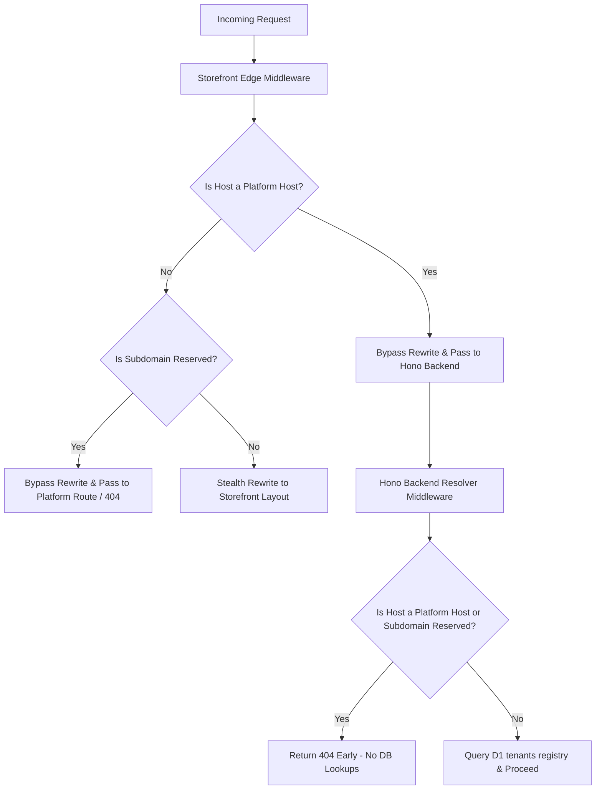
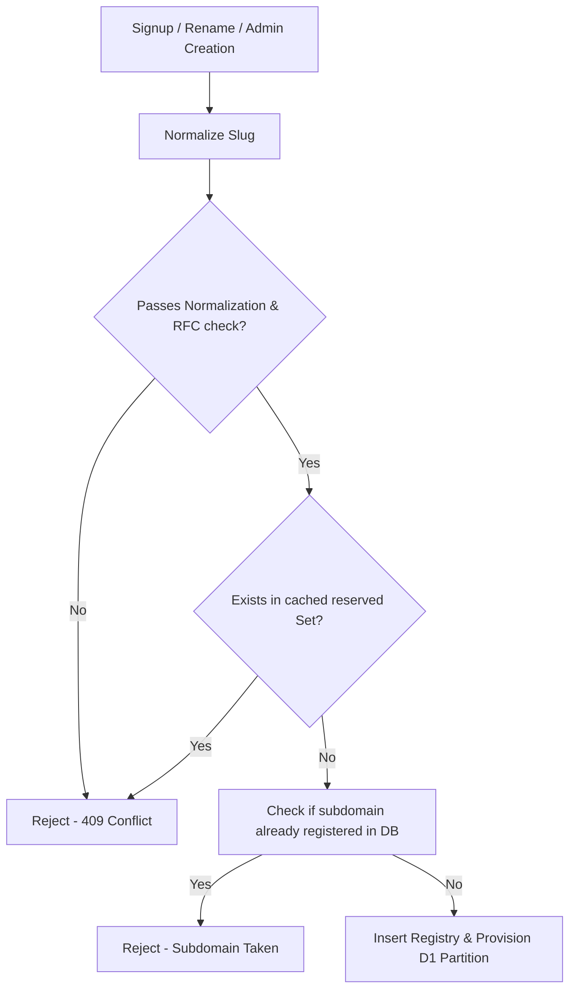

# Architecture Reference - Reserved Subdomain System

This document outlines the design, security controls, and routing mechanisms of the centralized reserved subdomain and platform hostname system in Basecart.

---

## 1. Why Reserved Names Exist

To ensure platform integrity and security, certain hostnames and subdomains must be blocked from public registration:
- **Prevent Hijacking/Phishing**: Block attackers from registering storefronts like `admin.basecart.app`, `merchant.basecart.app`, `login.basecart.app` or `billing.basecart.app` to host phishing templates targeted at store owners.
- **Routing Integrity**: Centralized services are routed natively via Cloudflare DNS rules. If a tenant could claim `api` or `cdn`, storefronts attempting to resolve platform assets might resolve to user-owned content.
- **Future Proofing**: Placeholders for anticipated features (e.g. `partners`, `developers`, `internal`, `future`) are blocked early to prevent customer-migration headaches when those features launch.

---

## 2. Centralized Configuration

All platform hostnames and reserved subdomains are maintained in the `@basecart/shared` package under `packages/shared/src/platformRoutes.ts`.

### Categorization

Subdomains are grouped into logical sets:
- **`SYSTEM_SUBDOMAINS`**: Core platform routes (`admin`, `merchant`, `api`, `www`, `docs`, `status`).
- **`NETWORK_SUBDOMAINS`**: System email and file servers (`mail`, `smtp`, `imap`, `mx`, `ftp`, `pop`).
- **`STATIC_SUBDOMAINS`**: Content delivery and media hosts (`cdn`, `assets`, `static`, `images`, `media`).
- **`AUTH_SUBDOMAINS`**: Authentication and profile dashboards (`login`, `auth`, `account`, `dashboard`).
- **`FUTURE_SUBDOMAINS`**: Placeholders for future platform features (`billing`, `payments`, `developers`, `partners`, `monitor`, `metrics`, `internal`, `future`).

A single cached `Set<string>` is initialized on startup to provide $O(1)$ lookup complexity, avoiding array recreations during high-throughput requests.

---

## 3. Normalization & RFC Compliance

Before validation, subdomain inputs undergo strict normalizations:
1. **Trimming & Lowercasing**: Removes whitespace and ignores case.
2. **Consecutive Dot Collapsing**: Collapses multi-dot sequences (e.g. `n..ike` becomes `n.ike`).
3. **Unicode Rejection**: Rejects any non-ASCII characters to prevent IDN homograph attacks (e.g. cyrillic "a" replacing latin "a").
4. **Space Rejection**: Refuses strings containing spaces.
5. **RFC Compliance**: Verifies characters match `^[a-z0-9.-]+$` and prevents leading/trailing hyphens or dots.

---

## 4. Routing Flow



---

## 5. Validation Flow



---

## 6. Audit & Abuse Logging

Any attempt to register, check, or provision a reserved platform subdomain triggers a security audit log inside `packages/backend/src/lib/audit.ts` to help detect brute-force scans or admin bypass attempts:

```json
{
  "event": "RESERVED_SUBDOMAIN_ABUSE",
  "timestamp": "2026-07-18T10:00:00.000Z",
  "ip": "203.0.113.195",
  "userId": "anonymous",
  "attemptedSlug": "admin",
  "route": "/auth/merchant/signup"
}
```

Audit alerts are printed to `console.warn` as structured JSON, enabling immediate indexing by log management aggregators.

---

## 7. How to Add New Reserved Subdomains

1. Open `packages/shared/src/platformRoutes.ts`.
2. Locate the appropriate category array (or add a new one).
3. Append the desired slug in lowercase.
4. Run `npm run build --workspace=packages/shared` to compile and distribute updates.
