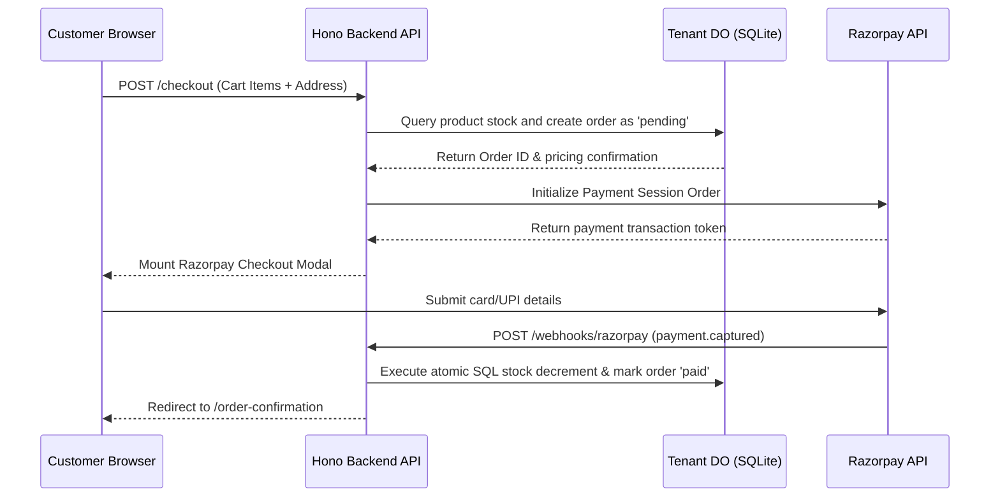

# Application Flow Specifications — Basecart

## 1. Domain Resolution & Routing
When a customer requests a domain (e.g. `watchroom.basecart.app`):
1. **Edge Router**: Hono middleware intercepts the request, parses the hostname/subdomain, and executes a lookup against the central D1 control registry.
2. **Tenant Resolution**: D1 returns `tenantId`, verification status, and subscription parameters.
3. **DO Binding**: Hono accesses the specific `TenantDOProd` namespace instance tied to that `tenantId`.
4. **Data Delivery**: Storefront retrieves active catalogs, category maps, and layout metadata directly from the DO storage in V8 memory.

## 2. Integrated Checkout Flow

