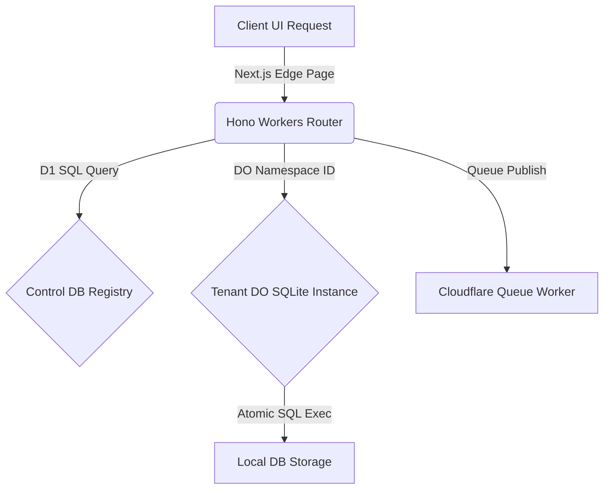

# System Implementation Roadmap — Basecart

## 1. Implementation Architecture & Data Flow

## 2. Project Roadmap & Deployment Progress

### Phase 1: Core Routing & Schema Init (Completed)
* [x] Design multi-tenant domain mapping middlewares.
* [x] Formulate global D1 control schema and isolation databases.
* [x] Set up Wrangler environment parameters for production environments.

### Phase 2: Theme SDK & Platform Integration (Completed)
* [x] Implement sandboxed Theme parser & validator tools.
* [x] Wire all 26 Admin Panel module views to perform live SQL fetches from D1.
* [x] Integrate webhook triggers for Razorpay orders and stock transactions.

### Phase 3: Enhancement Backlog (Next Steps)
* [ ] Implement CSRF double-submit token check middleware for state mutations.
* [ ] Connect Settings control panels to the admin-wide settings configuration API.
* [ ] Integrate discount validations directly with cart templates.
